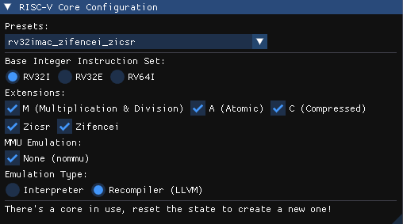

# Risky

A modular, RISC-V interpreter written in C++23


https://github.com/user-attachments/assets/4a6dec5a-2208-4dd9-a5bf-c101c5a43fc8


Risky booting [Borax](https://github.com/cakehonolulu/borax) with LLVM IR JIT backend


## Compiling

* Clone the repository and it's submodules

```bash
git clone https://github.com/cakehonolulu/Risky --recurse-submodules
```

* Install the required dependencies

Ubuntu/Debian:

```bash
sudo apt install build-essential gcc cmake
```

This project uses the still-in-beta SDL3.

Since SDL3 builds still have not hit the main software repos, it's recommended to download the *.deb files for libsdl3 and libsdl3-dev and install them using:

```bash
sudo dpkg -i libsdl3.deb libsdl3-dev.deb
```

You can find the deb files over at:

https://packages.debian.org/experimental/amd64/libsdl3-dev

Or if you prefer, you can build SDL3 from source and use that instead.

## Usage

Execute the application, provided you use the more mature ImGui frontend; you'll be asked to create a RISC-V core; choose between the available base ISA/extensions and you're good to go.

<p align="center">
  
</p>

Simply open a binary file containing the desired code to run and step through it.

## Resources

https://luplab.gitlab.io/rvcodecjs/

https://github.com/riscv/riscv-isa-manual/releases/tag/20240411

https://riscv.org/wp-content/uploads/2017/05/riscv-privileged-v1.10.pdf

## Contributing

Pull requests are welcome. For major changes, please open an issue first
to discuss what you would like to change.

Please make sure to update tests as appropriate.

## License

[MIT](https://choosealicense.com/licenses/mit/)
